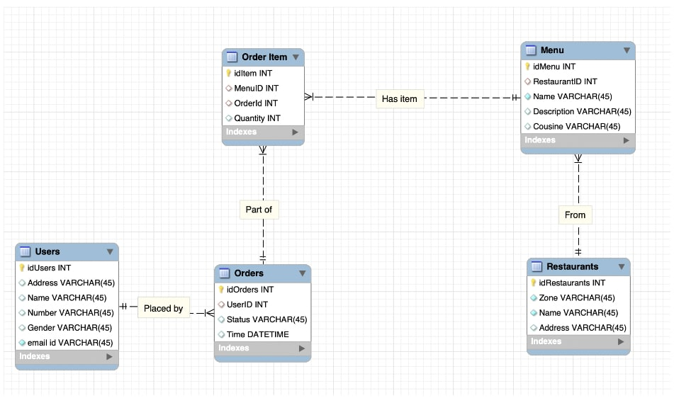
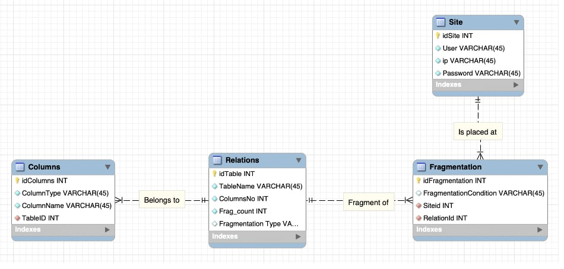

# Distributed-DBMS-for-Restaurants
Part of Distributed Data Systems Course, Spring-2022, IIIT-H.

## System Overview
### Application Info
We have the restaurant database where:
- Each restaurant belongs to a zone and serves a variety of Menu.
- Each order consists of a list of Menu items along with their quantity.  
- A user can place an order based on their Address.

### System Catalogue
For our system catalogue, we chose to have 4 tables, with the Relation
table storing the list of tables, Columns table storing the list of
columns, fragment table storing the list of fragment and site id, and
Sites for list of sites, their hosts, ip, usernames etc

## Site Information
We store our data partitioned across 4 sites as follows - 

### Allocation

| Node num  | IP Address | Hostname |
|---|---|---|
| 1  | 10.3.5.211  | CP5 |
| 2  | 10.3.5.208  | CP6 |
| 3  | 10.3.5.204  | CP7 |
| 4  | 10.3.5.205  | CP8 |

### Fragmentation
| Table  | Fragmentation | Sites |
|---|---|---|
| Restaurant  |  Horizontal (Based on ZONE) | 5,6,7,8 |
| Menu  |  Derived Horizontal (Based on Restaurant.ZONE) | 5,6,7,8 |
| User  |  Vertical | 5,6,7 |
